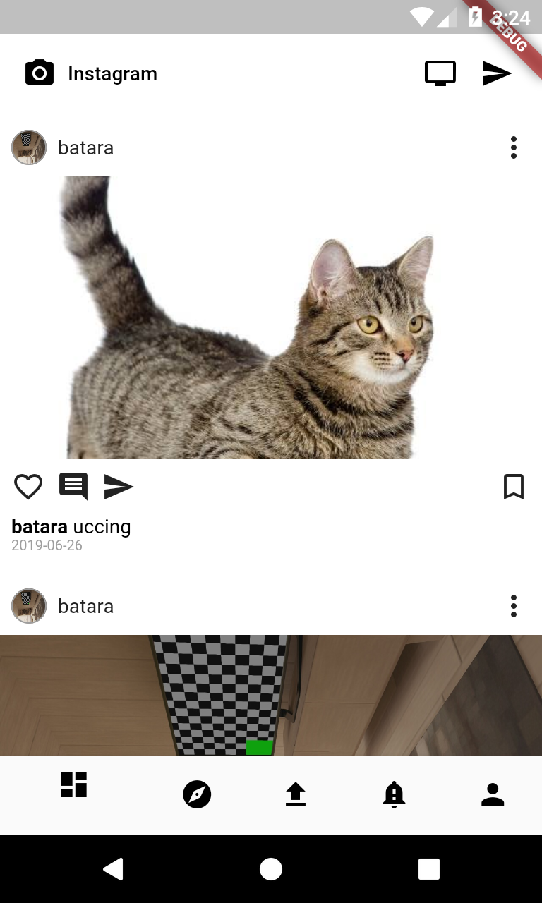

# Flutter Insta

An Instagram clone written in Flutter using rails REST API as backend service.

## Getting Started

setup the [insta-geram-api](https://github.com/kanaydo/insta-geram-api) follow the instruction.
...
https://github.com/kanaydo/flutter-insta.git"
cd flutter-insta
flutter pub get
...
